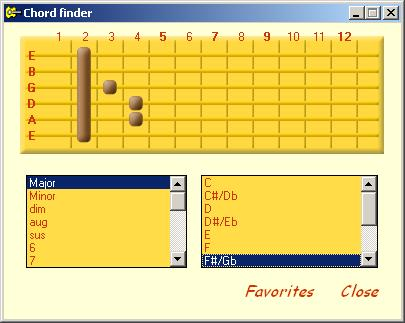



## HtGuitar Guitar chords, Notes and Metronome

### Description

Guitar chord finder, note table and metronome
 
### More Info
 

             |
---                |---
**Submitted On**   |2005-04-10 18:18:18
**By**             |[haliltunc](https://github.com/Planet-Source-Code/PSCIndex/blob/master/ByAuthor/haliltunc.md)
**Level**          |Advanced
**User Rating**    |5.0 (60 globes from 12 users)
**Compatibility**  |VB 5\.0, VB 6\.0
**Category**       |[Complete Applications](https://github.com/Planet-Source-Code/PSCIndex/blob/master/ByCategory/complete-applications__1-27.md)
**World**          |[Visual Basic](https://github.com/Planet-Source-Code/PSCIndex/blob/master/ByWorld/visual-basic.md)
**Archive File**   |[HtGuitar\_G1876194132005\.zip](https://github.com/Planet-Source-Code/haliltunc-htguitar-guitar-chords-notes-and-metronome__1-59944/archive/master.zip)

